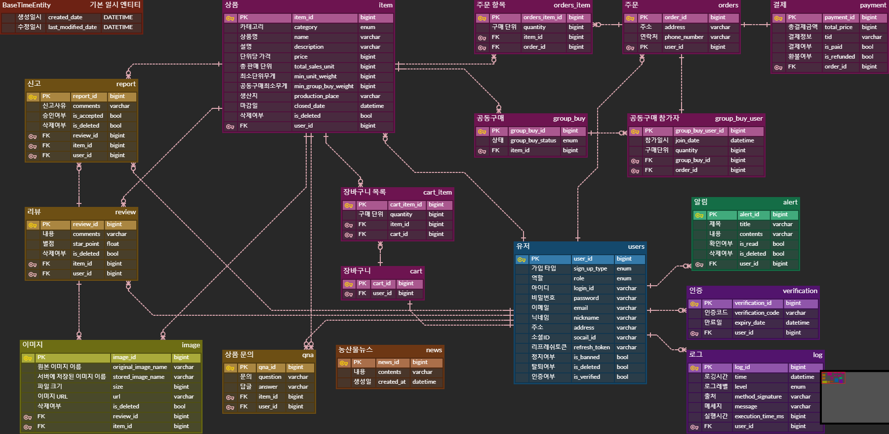

# 곱게 못난이, gracefully-ugly
### 못난이 농산물 공동구매 사이트
- 최근 치솟는 농산물 가격에 소비자들이 부담을 느끼고 있으니 '공동구매 + 못난이 농산물 구매' 두 가지 장치로 가격 절감을 하자는 아이디어로 이어졌습니다. 판매자는 못났다는 이유로 폐기되는 못난이 농산물로 수익을 창출할 수 있고 구매자는 비싼 농산물 가격 대신 공동구매를 통해 좀 더 싼 가격으로 농산물을 구매할 수 있습니다.
- 판매자는 원하는 공동구매 조건을 정해 인원을 모집할 수 있고, 구매자는 공동구매에 자유롭게 참여할 수 있습니다.
- 이스트소프트의 앨런 AI 기능을 사용해 메인 페이지에서 농산물 관련 최신 뉴스를 확인할 수 있습니다.

- http://15.164.14.204:8080/
- 관리자 계정 admin/admin
- 상품 신고 관리 http://15.164.14.204:8080/admin-report
- 판매자 계정 seller/seller , seller100/seller100 , seller200/seller200 , hello/hello    ...

## 팀 소개
<table>
    <tr>
        <th>박준석</th>
        <th>정진환</th>
        <th>류석현</th>
        <th>이현진</th>
	<th>권현수</th>    
    </tr>
    <tr>
	    <td></td>
	    <td></td>
	    <td></td>
	    <td></td>
	    <td>사진</td>
    </tr>
    <tr>
	    <td>ERD설계/프로젝트 배포/이스트소프트 앨런API 뉴스/로그/인증/신고/리뷰/QnA/유저/상품/이미지 등의 API 개발/테스트 코드 작성</td>
	    <td>찜 목록,주문/결제/공동구매 프로세스 개발 및 테스트 코드 작성/수정, 버그 관리, 카카오 페이 API 연동</td>
	    <td>JWT, OAuth2 활용한 회원가입/로그인/로그아웃 개발, 상품 문의, 코드 리팩토링, 버그 관리, 발표</td>
	    <td>메인 화면 CRUD 개발/버그 관리/프로젝트 산출물 작업</td>
	    <td>구매내역 페이지 제작</td>
    </tr>
</table>    
    
## 개발 일정

## 사용 스택
### Back-end
|   Java   |   Spring   |   Spring Boot   |   MySQL   |   AWS   |
| :----------------------------------------------------------: | :----------------------------------------------------------: | :----------------------------------------------------------: | :----------------------------------------------------------: | :----------------------------------------------------------: |
| 

 |  |  | 

 | 

 |

### Front-end
|     Html     |     CSS     |     JavaScript     |     Figma     |  
| :----------------------------------------------------------: | :----------------------------------------------------------: | :----------------------------------------------------------: | :----------------------------------------------------------: | 
|  | 

 | 

 | 

  |

### Tools
| Github | Discord | Notion | 
| :--------: | :--------: | :------: |
|  |  |  |

## erd 
링크 : https://www.erdcloud.com/d/mES7Ns2mBDw5ocA8t

## 기능 명세
### 요구사항 기능 정리

#### 회원

- [x] 회원 가입
	- [x] 아이디, 비밀번호, 닉네임, 주소, 판매자 혹은 구매자 선택.
- [x] 로그인
- [x] 로그 아웃
- [x] 회원 탈퇴
- [x] 회원 등급
  	- [x] SELLER, BUYER, ADMIN, GUEST
  	- [x] GUEST : 처음 회원가입시 GUEST부여한 후 2차 회원가입 진행
   	- [x] ADMIN : /admin-report 페이지에서 신고된 상품이나 리뷰를 관리함.
   	- [ ] ADMIN : /admin 페이지에서 회원 등급 변경 가능
- [x] 회원 정보
  	- [x] 회원 정보 수정
   	- [x] 이메일 인증 (이메일로 결제, 환불 알림)
       

#### 상품 게시글
- [x] 작성 권한(SELLER, ADMIN)
	- [x] 작성 한 판매 게시글은 본인만 수정, 삭제 가능함		
- [x] 판매 내역
	- [x] 판매내역 페이지에서 판매 상품 등록 버튼을 통해 접근할 수 있음. 상품에 대한 정보를 입력하여 판매글의 속성을 정함. 상품에 대한 설명과 상품 사진을 업로드할 수 있음.
- [x] 세부 판매 내역
	- [x] 판매내역 페이지에서 관리하러 가기 버튼을 통해 접근할 수 있음.
	- [x] 구매자의 닉네임 구매 가격, 결제 상태, 환불 여부, 주문일, 주소 등을 확인할 수 있음.
 	- [x] 리뷰와 문의사항을 한번에 확인.
- [x] 상품 상세 페이지
	- [x] 메인 페이지에서 상품 이미지를 클릭하여 상품 상세 페이지로 이동(혹은 판매자는 판매내역 페이지에서 글 보러가기 버튼으로 이동).
 	- [x] 상품의 정보 확인, 상품의 리뷰 확인, 공동구매 참여, 상품 문의, 상품 신고 등을 수행할 수 있음.

#### 공동구매참여, 주문, 결제
- [x] 상품 상세의 공동구매 참여버튼 혹은 찜 목록의 결제하기 버튼을 통해 공동구매를 시작할 수 있음.
	- [x] 구매할 상품의 수량, 구매자 주소, 연락처를 입력하고 주문하기 버튼을 누름
 		- [x] 주문서의 내용대로 카카오페이로 결제가 진행됨. (상품 재고 감소)
		- [x] 공동구매 프로세스가 실행됨.
  			- [x] 이미 공동구매 최소 단위를 넘겨서 주문했다면 공동구매 상태 = COMPLETED (공동구매 완료 처리(배송 진행))
     			- [x] 아직 공동구매 최소 단위를 넘기지 못했다면 공동구매 상태 = IN_PROGRESS 가 되고 모집중인 공동구매로 처리됨
        			- [x] 이때 환불 버튼을 눌러 환불 진행 가능 (상품 재고 증가)
        		- [x] IN_PROGRESS 로 공동구매가 진행 중에 상품의 마감 기한이 도래하면 공동구매 상태 = CANCELLED 로 변경되고 공동구매가 취소됨.
          			- [x] 환불 처리 (상품 재고 증가)

#### 리뷰
- [x] 구매내역 페이지의 후기 남기기 버튼을 통해 리뷰 작성
	- [x] 상품의 별점을 선택하고 상품 사진과 함께 리뷰 내용을 등록
- [x] 상품 게시글에서 등록된 리뷰 조회
- [x] 상품 게시글에서 사용자들이 남긴 별점의 합산 평균을 제공

#### 신고
- [x] 상품 상세 페이지의 상품 신고 버튼을 통해 상품 신고서 작성
- [x] 관리자는 /admin-report 페이지에서 신고된 상품에 대한 관리
	- [x] 잘못된 신고 처리. (신고 삭제)
 	- [x] 신고 승인.
		- [x] 신고 승인된 상품은 조회 불가

#### 상품QnA
- [x] 상품 상세 페이지의 문의하기 버튼을 통해 상품 QnA 작성
	- [x] BUYER, SELLER, ADMIN 모두 상품 문의를 작성함.
 	- [x] 상품의 주인(SELLER)만 문의에 대한 답글을 작성.
 		- [x] 이미 답글을 단 문의는 답글과 함께 노출
   		- [x] 답글을 달지 않은 문의는 답변하기 버튼(주인)에게만 노출되며 클릭하면 답변 칸 노출		

#### 이스트소프트 AI 앨런 API
- [x] 이스트소프트의 AI 앨런을 통해 메인 페이지의 농산물 관련 뉴스 5개 출력
	- [x] 1시간에 1번씩 앨런 API에 농산물 뉴스를 요청하고 DB에 보관. (스케쥴링)
	- [x] 생성된지 2시간이 지난 뉴스들은 DB에서 자동 삭제. (스케쥴링)

#### 인증
- [x] 회원 정보 페이지의 이메일 인증 버튼을 통해 이메일 인증.
- [x] 인증된 회원은 상품 결제 이후 공동구매 상태가 IN_PROGRESS 일때 환불 버튼을 눌러 환불처리시 이메일로 내용을 확인받을 수 있음.

#### AOP 로깅
- [x] 로깅과 성능 측정을 자동화
- [x] 각 유저의 행동을 DB에 담음.
	- [x] 어떤 유저가 어떤 행동을 하다가 어떤 병목에 걸렸는지.
 	- [x] 어떤 예외가 발생했는지 확인할 수 있음.
     
#### 테스트코드
- [x] 100여종류의 테스트코드를 작성하여 코드 안정성 향상에 노력.

### 공동 구매 프로세스 (왼쪽 - 결제 프로세스 / 오른쪽 - 공구 진행 프로세스)

## 화면 설계서
### 구매자 화면
|                             로그인 페이지                              |                          소셜 로그인 페이지                           |
|:----------------------------------------------------------------:|:---------------------------------------------------------------:|
|  |  |

|                             회원가입(1차) 페이지                              |                          회원가입(2차) 페이지(집접 회원가입 및 소셜 첫 로그인시)                           |
|:----------------------------------------------------------------:|:---------------------------------------------------------------:|
|  |  |

|                           소셜 로그아웃 페이지                           |
|:----------------------------------------------------------------:|
|  |

|                                메인 페이지                                |                                 공동 구매 페이지                                 |
|:--------------------------------------------------------------------:|:-------------------------------------------------------------------------:|
|  |  |

|                              주문서 작성 페이지                               |                                 주문 완료 페이지                                 |
|:---------------------------------------------------------------------:|:-------------------------------------------------------------------------:|
|  |  |

|                              주문서 조회 페이지                               |                               주문서 수정 페이지                                |
|:---------------------------------------------------------------------:|:-----------------------------------------------------------------------:|
|  |  |

|                            찜 목록 페이지                             |                                  주문 내역 페이지                                  |
|:---------------------------------------------------------------:|:---------------------------------------------------------------------------:|
|  |  |

|                              리뷰 페이지                               |                              신고 페이지                               |
|:-----------------------------------------------------------------:|:-----------------------------------------------------------------:|
|  |  |

|                              내 정보 페이지                              |                                회원 정보 수정 페이지                                 |
|:------------------------------------------------------------------:|:---------------------------------------------------------------------------:|
|  |  |

|                               이메일 인증 페이지                                |
|:-----------------------------------------------------------------------:|
|  |

### 판매자 화면
|                               판매 리스트 페이지                               |                               상세 판매 내역 페이지                               |
|:----------------------------------------------------------------------:|:------------------------------------------------------------------------:|
|  |  |

|                                판매글 작성 페이지                                |                                     판매글 수정 페이지                                     |
|:------------------------------------------------------------------------:|:----------------------------------------------------------------------------------:|
|  |  |

### 관리자 화면
|                                  관리자 회원 관리 페이지                                   |                              관리자 신고 관리 페이지                              |
|:--------------------------------------------------------------------------------:|:-----------------------------------------------------------------------:|
|  |  |

## 시스템 구조도

## api 명세
링크 : http://15.164.14.204:8080/swagger-ui/index.html

## 시연 영상

 
https://youtu.be/A6OFAHPrE4s
